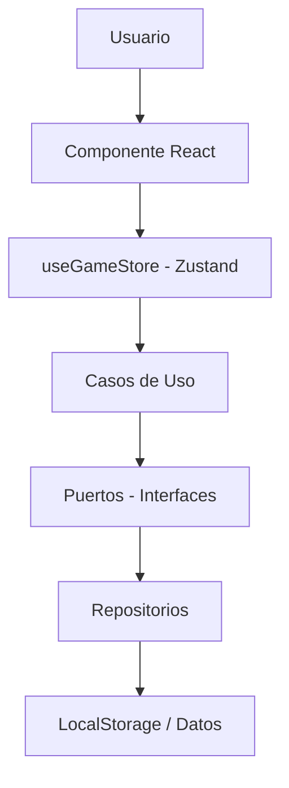

# 🌱 NASA Space Challenge - Arquitectura del Sistema

## 📋 Resumen Ejecutivo

Este proyecto implementa una **arquitectura hexagonal** (puertos y adaptadores) con **Zustand** para el manejo de estado global. El sistema permite a los usuarios jugar una trivia agrícola educativa con diferentes cultivos (maíz, papa, quinoa), progresando a través de 6 niveles de dificultad.

## 🏗️ Arquitectura Hexagonal

```
core/
├── domain/               # Núcleo del negocio (independiente)
│   ├── entities/        # Entidades del dominio
│   └── ports/          # Interfaces (contratos)
├── application/         # Casos de uso y lógica de aplicación
│   └── useGameStore.ts # Store de Zustand
└── infrastructure/      # Implementaciones concretas
    ├── data/           # Datos estáticos (preguntas)
    └── repositories/   # Implementación de repositorios
```

### ✨ Ventajas de esta Arquitectura

1. **Independencia del dominio**: La lógica de negocio no depende de frameworks
2. **Testeable**: Cada capa puede probarse independientemente
3. **Escalable**: Fácil cambiar implementaciones (ej: localStorage → API)
4. **Mantenible**: Código organizado y con responsabilidades claras

## 🔧 Componentes Principales

### 1. **Domain Layer** (Capa de Dominio)

#### Entidades

- `Player.ts`: Representa al jugador
- `Crop.ts`: Tipos de cultivos (corn, potato, quinoa)
- `Level.ts`: Los 6 niveles del juego
- `Question.ts`: Preguntas y respuestas
- `GameSession.ts`: Sesión de juego con progreso

#### Puertos (Interfaces)

- `IQuestionRepository`: Contrato para obtener preguntas
- `IGameSessionRepository`: Contrato para persistir sesiones

### 2. **Infrastructure Layer** (Capa de Infraestructura)

#### Datos

- `cornQuestions.ts`: 30 preguntas para maíz (5 por nivel)
- `potatoQuestions.ts`: 30 preguntas para papa (5 por nivel)
- `quinoaQuestions.ts`: 30 preguntas para quinoa (5 por nivel)

**Total: 90 preguntas únicas**

#### Repositorios (Adaptadores)

- `InMemoryQuestionRepository`: Implementa IQuestionRepository usando arrays
- `LocalStorageGameSessionRepository`: Implementa IGameSessionRepository usando localStorage

### 3. **Application Layer** (Capa de Aplicación)

#### Store de Zustand (`useGameStore.ts`)

Gestiona todo el estado de la aplicación:

**Estado:**

- `session`: Sesión actual del jugador
- `currentQuestions`: Preguntas del nivel actual
- `currentQuestionIndex`: Pregunta actual
- `answers`: Respuestas del jugador

**Acciones:**

- `initializeSession()`: Crea nueva sesión
- `loadSession()`: Carga sesión existente
- `selectCrop()`: Cambia de cultivo
- `startLevel()`: Inicia un nivel
- `selectAnswer()`: Selecciona respuesta
- `submitAnswer()`: Envía respuesta
- `finishLevel()`: Completa nivel y guarda progreso

## 📊 Flujo de Datos



## 🎮 Flujo del Juego

### 1. Inicio (`/game-entry`)

```typescript
// Usuario ingresa nombre y selecciona cultivo
await initializeSession("Pedro Agricultor", "corn");
// → Crea sesión en localStorage
// → Inicializa progreso para todos los cultivos
// → Navega a /dashboard-game
```

### 2. Dashboard (`/dashboard-game`)

```typescript
// Carga la sesión existente
await loadSession();

// Obtiene niveles con su estado
const levels = getLevelsForCurrentCrop();
// → Nivel 1: available
// → Niveles 2-6: locked

// Usuario selecciona nivel disponible
// → Navega a /dashboard-game/[levelId]
```

### 3. Trivia (`/dashboard-game/[levelId]`)

```typescript
// Inicia el nivel
await startLevel(levelId);
// → Carga preguntas del cultivo y nivel
// → Reinicia contador de respuestas

// Por cada pregunta:
selectAnswer(index); // Usuario selecciona
await submitAnswer(); // Verifica respuesta
nextQuestion(); // Avanza a siguiente

// Al terminar todas las preguntas:
await finishLevel();
// → Calcula score
// → Guarda progreso
// → Desbloquea siguiente nivel
// → Actualiza localStorage
```

## 🔄 Cambio de Implementación (Ejemplo)

### Actual: LocalStorage

```typescript
class LocalStorageGameSessionRepository implements IGameSessionRepository {
  async saveSession(session: GameSession): Promise<void> {
    localStorage.setItem("session", JSON.stringify(session));
  }
}
```

### Futuro: API Backend

```typescript
class ApiGameSessionRepository implements IGameSessionRepository {
  async saveSession(session: GameSession): Promise<void> {
    await fetch("/api/sessions", {
      method: "POST",
      body: JSON.stringify(session),
    });
  }
}
```

**Solo hay que cambiar la instancia en `useGameStore`:**

```typescript
// Antes
sessionRepository: new LocalStorageGameSessionRepository(),

// Después
sessionRepository: new ApiGameSessionRepository(),
```

## 📦 Estructura de Datos

### GameSession (en localStorage)

```json
{
  "playerId": "uuid-123",
  "playerName": "Pedro Agricultor",
  "selectedCrop": "corn",
  "currentLevel": 3,
  "cropProgress": {
    "corn": {
      "cropType": "corn",
      "currentLevel": 3,
      "totalScore": 200,
      "levelsProgress": {
        "1": {
          "levelId": 1,
          "status": "completed",
          "score": 100,
          "correctAnswers": 5,
          "totalQuestions": 5,
          "completedAt": "2025-10-04T10:30:00Z",
          "answers": [...]
        },
        "2": {
          "levelId": 2,
          "status": "completed",
          "score": 100,
          "correctAnswers": 5,
          "totalQuestions": 5
        },
        "3": {
          "levelId": 3,
          "status": "available",
          ...
        },
        ...
      }
    },
    "potato": { ... },
    "quinoa": { ... }
  }
}
```

## 🎯 Características Implementadas

✅ Sistema de sesiones persistente (localStorage)  
✅ 3 cultivos diferentes (maíz, papa, quinoa)  
✅ 6 niveles progresivos  
✅ 90 preguntas únicas (30 por cultivo, 5 por nivel)  
✅ Sistema de puntuación (20 pts por respuesta correcta)  
✅ Desbloqueo automático de niveles  
✅ Progreso independiente por cultivo  
✅ Cambio de cultivo sin perder progreso  
✅ Arquitectura escalable y mantenible

## 🚀 Próximos Pasos

1. **Backend API**: Implementar repositorio con base de datos
2. **Autenticación**: Sistema de usuarios y login
3. **Leaderboard**: Tabla de posiciones global
4. **Timer**: Cronómetro para respuestas
5. **Achievements**: Sistema de logros y badges
6. **Analytics**: Estadísticas detalladas de rendimiento

## 📚 Uso del Sistema

### En Componentes

```typescript
import { useGameStore } from "@/core";

function MyComponent() {
  // Obtener estado
  const session = useGameStore((state) => state.session);
  const isLoading = useGameStore((state) => state.isLoading);

  // Obtener acciones
  const initializeSession = useGameStore((state) => state.initializeSession);
  const startLevel = useGameStore((state) => state.startLevel);

  // Usar acciones
  const handleStart = async () => {
    await initializeSession("Juan", "corn");
  };

  return <div>{session && <p>Hola, {session.playerName}!</p>}</div>;
}
```

### Getters Útiles

```typescript
const currentLevel = useGameStore((state) => state.getCurrentLevel());
const currentQuestion = useGameStore((state) => state.getCurrentQuestion());
const levels = useGameStore((state) => state.getLevelsForCurrentCrop());
const progress = useGameStore((state) => state.getLevelProgress(1));
```

## 🛠️ Tecnologías

- **Next.js 15**: Framework React
- **TypeScript**: Tipado estático
- **Zustand**: Gestión de estado global
- **TailwindCSS**: Estilos
- **Framer Motion**: Animaciones
- **Sonner**: Notificaciones (toasts)

---

**Autor**: Sistema de Arquitectura Hexagonal  
**Fecha**: Octubre 2025  
**Versión**: 1.0.0
